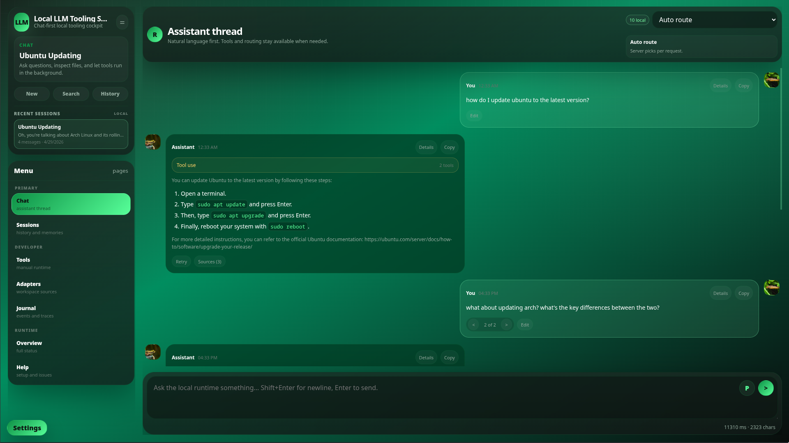
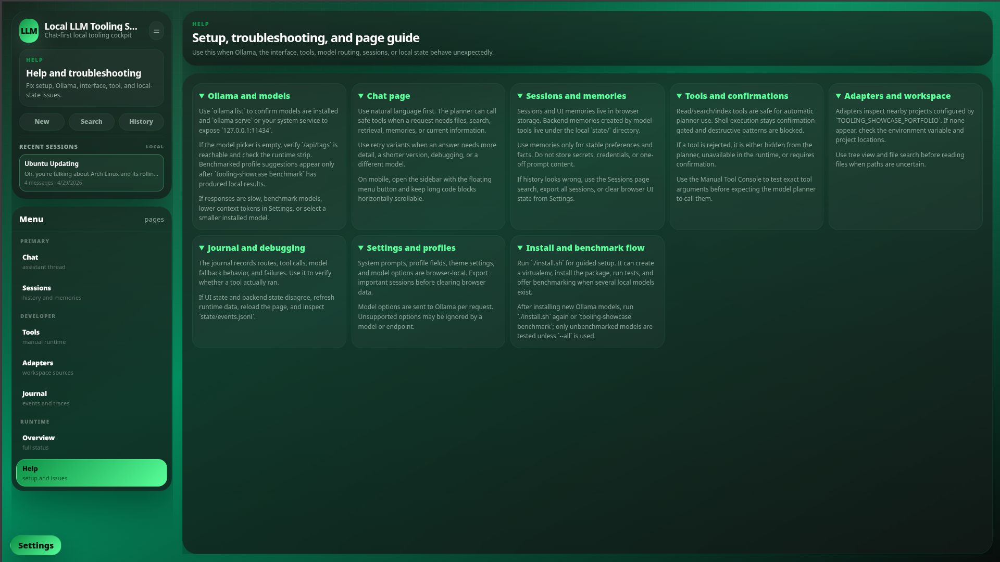
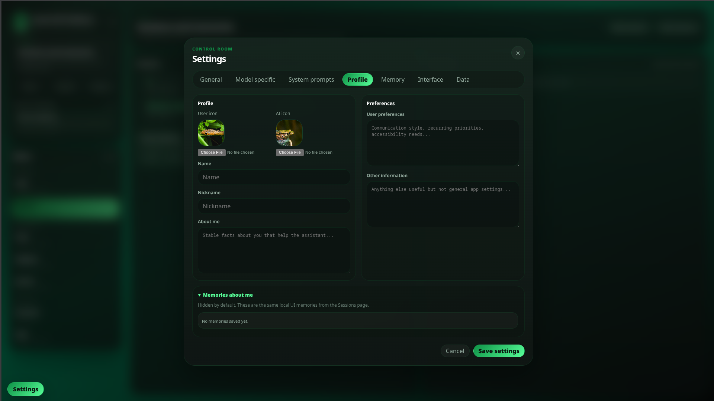
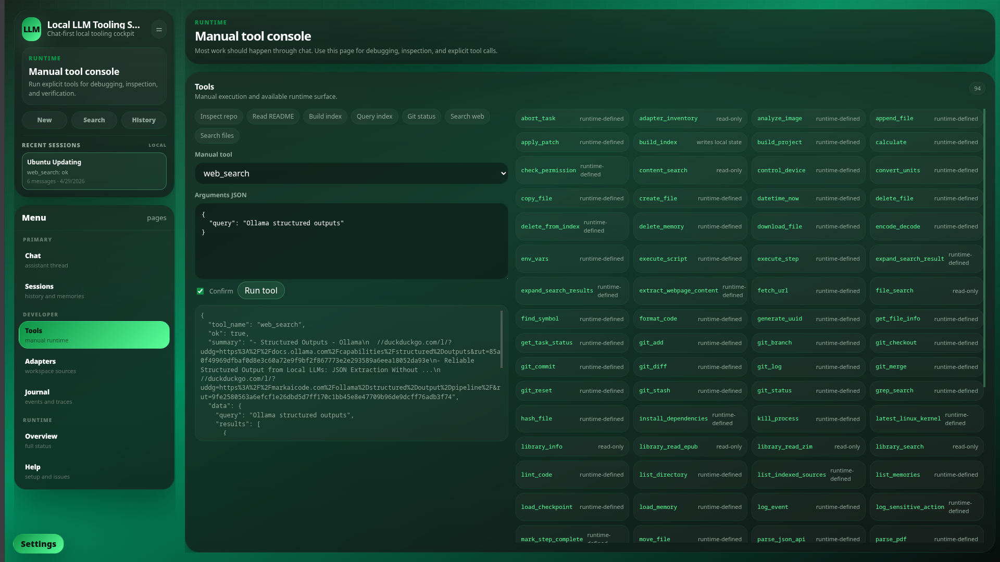
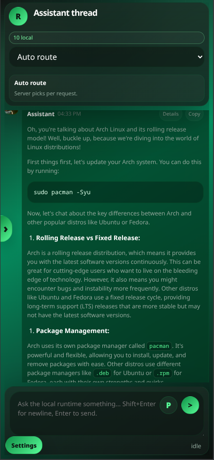
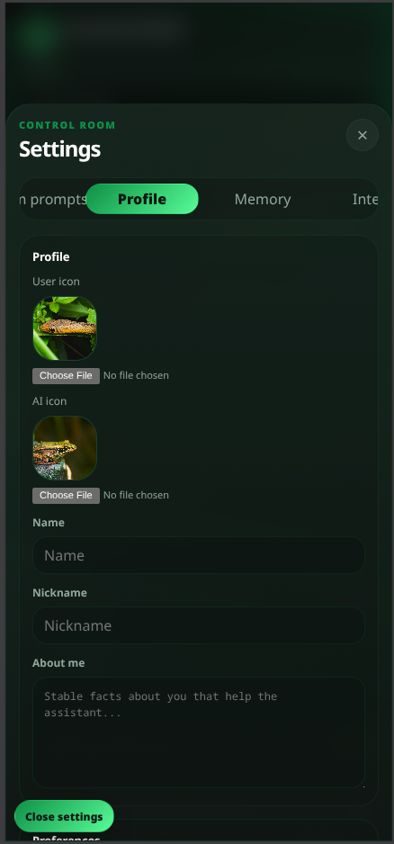
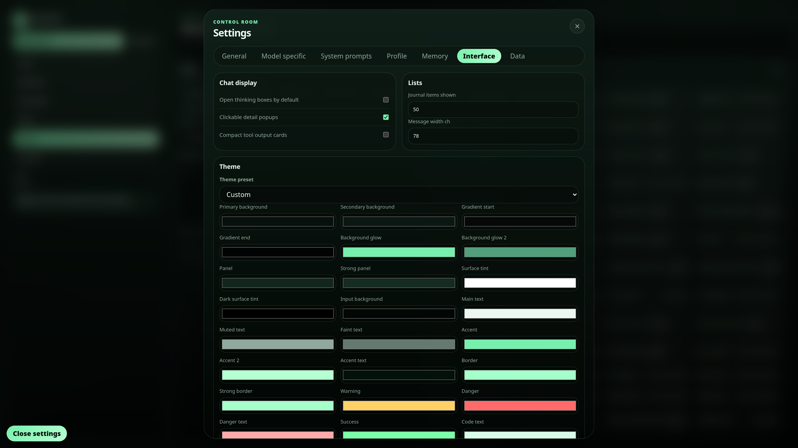

# Local LLM Tooling Showcase

`local-llm-tooling-showcase` is a compact local-first assistant runtime for showing how deterministic routing, guarded tools, local Ollama models, workspace adapters, and event logging fit together.

This is a showcase and starter skeleton, not a hosted SaaS product. It is designed to run on your machine, inspect your workspace, and keep risky local actions behind explicit boundaries.



## Highlights

- Chat-first web UI with local sessions, sidebar history, message variants, retries, hotlinked source views, profile settings, and runtime status.
- Deterministic routing for clean tool-shaped requests before involving an LLM.
- Model-directed tool loop for questions that need files, search, indexing, adapters, memories, or web context.
- Local benchmark suite that ranks installed Ollama models by task category before showing profile suggestions.
- Tool runtime with file search/read, content search, index build/query, web search, local library access, guarded shell execution, git-style inspection, and task state tools.
- Planner-safe tool protocol that exposes only selected tools to the model and marks shell execution as confirmation-gated.
- Ollama-compatible wrapper so other local clients can talk to the showcase through familiar `/api/chat` and `/api/generate` shapes.
- Event journal for observing routes, tool calls, responses, and autonomous-run traces.

## Quick Start

```bash
git clone https://github.com/Small-ed1/local-llm-tooling-showcase.git
cd local-llm-tooling-showcase
./install.sh
tooling-showcase serve
```

Open the web UI at:

```text
http://127.0.0.1:8123
```

Useful CLI checks:

```bash
tooling-showcase ask "find file README"
tooling-showcase ask "read file README.md"
tooling-showcase ask "search content ToolRuntime"
tooling-showcase ask "show adapters"
tooling-showcase journal --limit 5
tooling-showcase models
tooling-showcase benchmark --list-models
```

If Ollama is running locally, open-ended chat requests can use it automatically. If Ollama is not available, deterministic local tools still work and failed fallback paths stay explicit.

## Web UI

The stdlib web UI includes:

- chat with streaming responses, message editing, retry variants, hotlinked source drawers, and safe markdown rendering
- local browser sessions with search, recents, export, and deletion controls
- tool console with presets and raw JSON arguments for debugging
- adapters page for linked workspace projects
- journal page for backend event traces
- help page with Ollama, interface, tool, session, settings, adapter, and debugging guidance
- settings for models, system prompts, profile data, avatars, memories, theme colors, fonts, and data management
- mobile-first layout with an edge drawer trigger, narrower chat scaling, and mobile settings/help views

Run it with:

```bash
tooling-showcase serve
```

## Screenshots

Desktop captures are cropped to `1920x1080` for release pages and README previews.

| Help and setup | Chat thread |
| --- | --- |
|  |  |

| Profile settings | Manual tool console |
| --- | --- |
|  |  |

Mobile captures show the responsive drawer, chat, settings, and help layout.

<p>
  
  
  
</p>

## Ollama-Compatible Wrapper

Start both the showcase UI and the Ollama-compatible wrapper:

```bash
./start-servers.sh
```

Default endpoints:

- showcase web/API: `http://127.0.0.1:8123`
- raw Ollama: `http://127.0.0.1:11434`
- tool-capable Ollama wrapper: `http://127.0.0.1:11436`

Point local clients at the wrapper when you want the familiar Ollama API shape with this project's tool runtime underneath.

## Benchmarking

Model profile suggestions are hidden until local benchmark results exist. Run the suite with:

```bash
tooling-showcase benchmark
```

The suite covers context use, summarization, coding, debugging, reasoning, arithmetic, Linux triage, structured JSON/tool output, safety boundaries, planning, writing, extraction, roleplay tone, and retrieval strategy. Results are stored in `state/model_benchmarks.json` and auto-routing uses the best benchmarked model for each category.

By default, benchmarking only runs models that have not been profiled yet. Use `--all` to rebuild every local profile.

`./install.sh` prompts for benchmarking when more than three Ollama models are installed, and prompts again when newly installed models are detected.

## Safety Model

This project intentionally does not expose the whole machine directly to a model.

- Tool planning only sees the selected schemas in `tool_protocol.py`.
- Read/search/index tools are marked safe for automatic execution.
- Memory create/edit/delete/list/load tools are planner-visible for explicit user memory requests.
- Shell execution is guarded and not planner-safe by default.
- Risky shell patterns require confirmation, and blocked patterns are rejected.
- Tool calls are bounded, duplicate tool calls are skipped, and results are journaled.
- Browser sessions, memories, prompts, avatars, and theme settings are stored locally in browser storage.
- Model-created memories are stored locally in `state/memories.json`; do not store secrets there.

Review `AGENTS.md`, `tools.py`, and `tool_protocol.py` before using this against sensitive workspaces.

## Tested Behaviors

The test suite covers:

- deterministic routing and direct tool fallback
- model routing profile selection
- benchmark-derived model profiles
- model-directed tool calls and duplicate-call prevention
- planner restrictions for hidden or unsafe write tools
- shell confirmation behavior
- adapters, retrieval/indexing, journal behavior, and service fallback paths
- Ollama-compatible wrapper request shapes
- static server and UI marker behavior

Run all tests with:

```bash
pytest tests/
```

Run the frontend syntax check with:

```bash
node --check src/tooling_showcase/static/app.js
```

## Project Layout

```text
src/tooling_showcase/
  router.py          deterministic intent routing
  service.py         chat orchestration, tool loop, logging
  tools.py           local tool runtime and safety gates
  tool_protocol.py   planner-visible tool schemas
  model_routing.py   task-specific model profiles
  benchmarking.py    local Ollama benchmark suite and profile derivation
  server.py          stdlib web UI/API server
  ollama_wrapper.py  Ollama-compatible API facade
  static/            browser UI
tests/               regression tests
examples/assets/     small demo inputs for optional tools
examples/integrations/hyprland/
                     optional Hyprland sidebar integration
```

## Release Status

Current release line: `v0.1.0-alpha.4`.

This alpha is suitable for local demos, portfolio review, and continued development. It includes the benchmark suite, install flow, memory tools, mobile/sidebar polish, hotlinked sources, and screenshot assets. Expect UI and browser-local data shapes to keep changing before a stable `v1.0.0`.

## License

MIT. See `LICENSE`.
